## Systèmes experts : des règles écrites à la main

<figure class="photo"><figcaption><b>Deep Blue</b> (IBM) bat Garry Kasparov aux échecs en 1997</figcaption></figure>

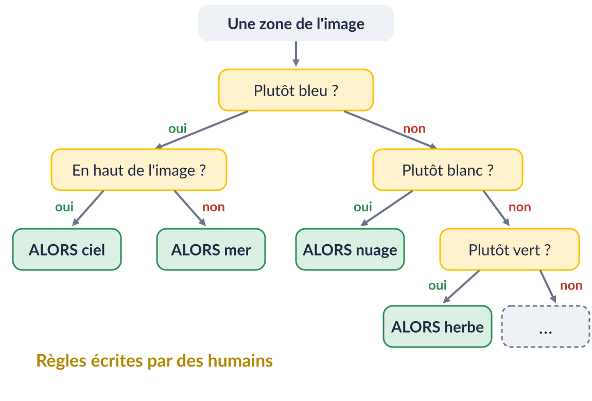

Photo : James the photographer, CC BY 2.0, via Wikimedia Commons

## Le Machine Learning : apprendre à partir d'exemples

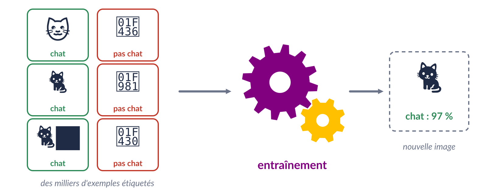{.fig}

## Un neurone est capable d'apprendre

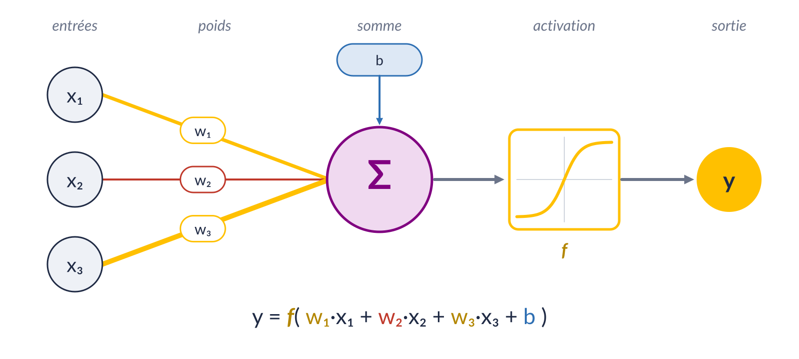{.fig}

## Entraîner un réseau de neurones à la main

<iframe class="demo" data-src="demos/reseau.html?ni=2&nh=1&hs=2&no=1&act=step&t=OU-EXCLUSIF"></iframe>

## Explosion de la taille des modèles

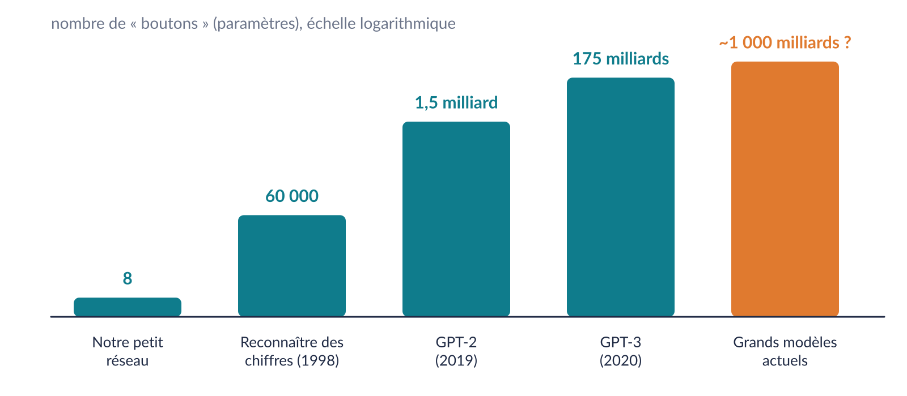{.fig}

## Entraînement automatique

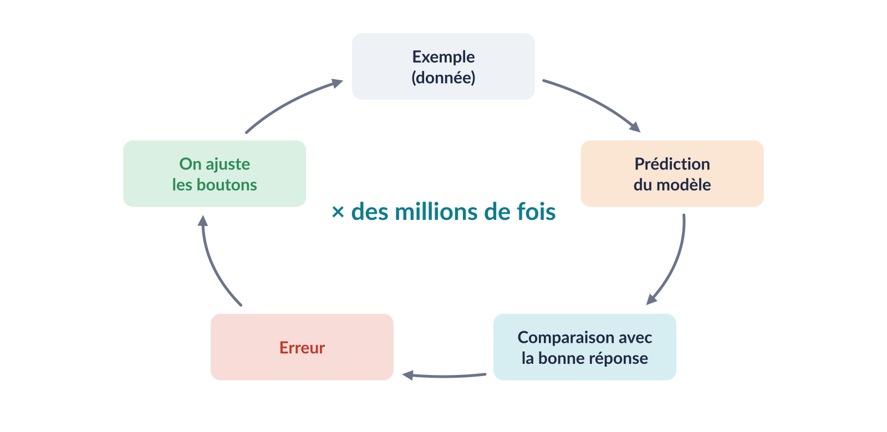{.fig}
<!-- les fleches ne sont pas visibles, fixer cette image -->

## Démo : la machine règle les boutons

<iframe class="demo" data-src="demos/entrainement.html"></iframe>
<!-- Le id "controls" doit etre mieux centre verticalement; je veux un bouton "poid aleatoires" et "RAZ poids"; je veux aussi pouvoir afficher/de-afficher le sens dans lequel l'exemple pousse; ajouter les objectifs "non-et" et "personalise" -->

::: notes
Même réseau que la démo « à la main » (2 entrées, 3 neurones cachés, 1 sortie, activation sigmoïde).
Poids tirés au hasard, puis à chaque étape : prédiction sur les 4 exemples, calcul de l'erreur,
chaque poids est ajusté un peu dans la direction qui réduit l'erreur (descente de gradient).
XOR : environ 300 étapes en moyenne. Vitesse = nombre d'étapes par image.
Relancer « Nouveaux poids » montre que le point de départ change, mais l'erreur finit par descendre.
:::

<!-- Ajouter une slide expliquant comment prendre 3 lettres en entree (activer le neurone correspondant), et predire la prochaine lettre (celle qui s'active le plus) -->

## Caractère vs mot vs token

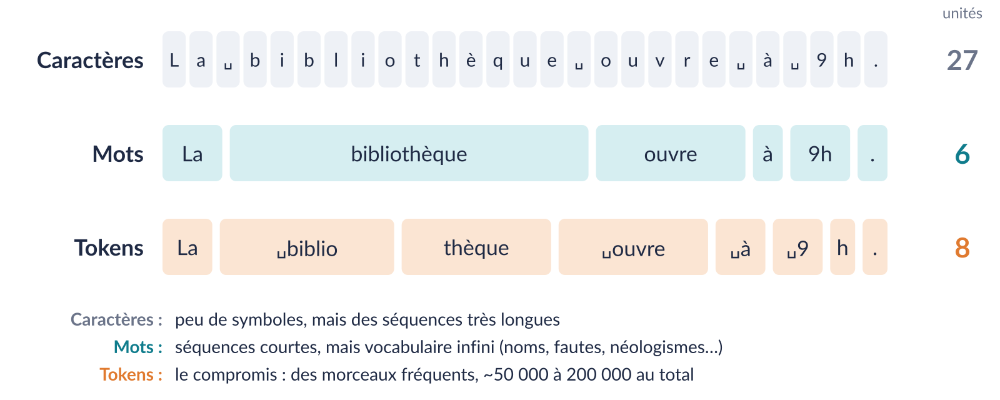{.fig}

## Prédire la suite d'un texte

« Paris est la capitale de la ___ »

::: {.fragment}

→ France

:::

::: {.fragment}

« Paris est la capitale de la France. Elle est située en ___ »

→ Europe

:::

## Token par token

<iframe class="demo" data-src="demos/token.html"></iframe>

## Variabilité des réponses

<iframe class="demo" data-src="demos/temperature.html"></iframe>

## La température

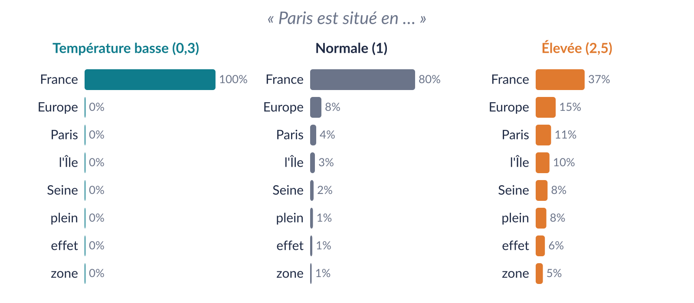{.fig}

## Une conversation dépend du point de vue

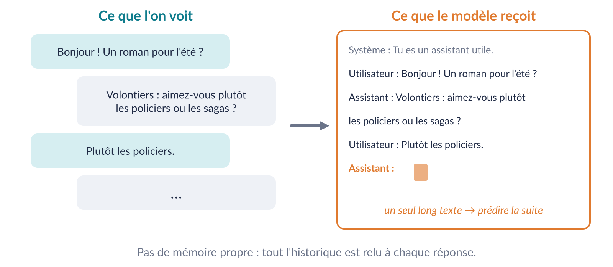{.fig}

## Raisonner par étapes (« chain of thought »)

3 étages × 12 rayonnages × 40 livres. 15 % sont prêtés. Combien de livres restent en rayon ? Réponse attendue : 1 224

<h3>Réponse courte</h3>

Il reste 1 350 livres.

<b>2</b> tokens faux

<h3>Réponse longue (avec étapes)</h3>

3 × 12 = 36 rayonnages. 36 × 40 = 1 400 livres. 15 % de 1 400 = 210. Il reste 1 400 − 210 = 1 190 livres.

<b>7</b> tokens faux : l'erreur se répète

À l'entraînement, chaque token faux est pénalisé : une erreur répétée dans un raisonnement coûte plus cher.

## Deux sources de biais

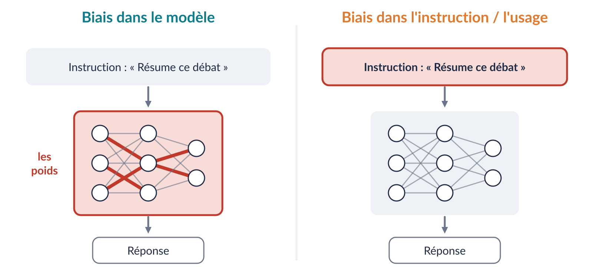{.fig}

## Biais d'entraînement
<!-- le modèle hérite de ses données -->

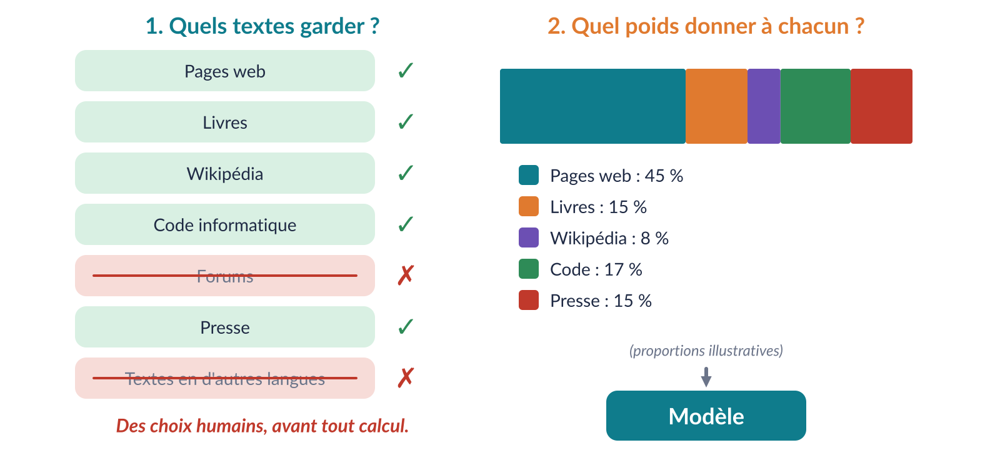{.fig}

## Biais d'utilisation
<!-- même modèle, réponses différentes -->

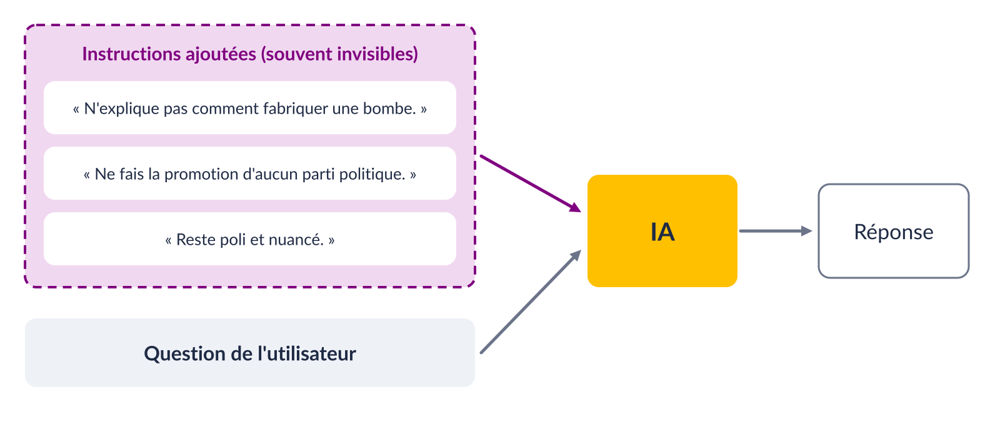{.fig}

## Écrire avec une IA peut changer notre opinion

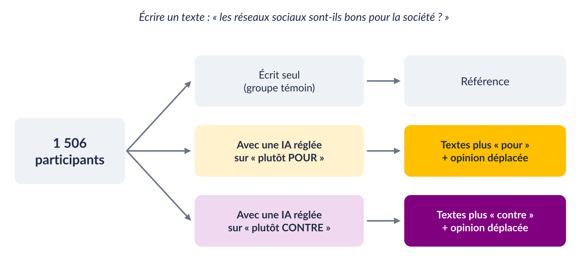{.fig-s}

La majorité des participants n'a pas remarqué que l'IA était orientée.

Jakesch, Bhat, Buschek, Zalmanson & Naaman, « Co-Writing with Opinionated Language Models Affects Users' Views », CHI 2023. <a href="https://doi.org/10.1145/3544548.3581196">doi:10.1145/3544548.3581196</a>

::: notes
Expérience en ligne, 1 506 participants, qui écrivent un court texte :
« les réseaux sociaux sont-ils bons pour la société ? ».
Une partie d'entre eux utilise un assistant d'écriture (GPT-3) configuré pour pencher d'un côté.
Résultat : les textes penchent dans le sens de l'IA, ET l'opinion mesurée ensuite dans un questionnaire se déplace aussi.
Deux fois plus de chances d'écrire un paragraphe d'accord avec l'assistant (Cornell Chronicle, mai 2023).
La majorité des participants n'a même pas remarqué que l'IA était biaisée.
Retour à la question d'ouverture : oui, une IA peut influencer ce que l'on pense sans dire quoi penser.
:::

<!-- ## L'IA dans la recherche

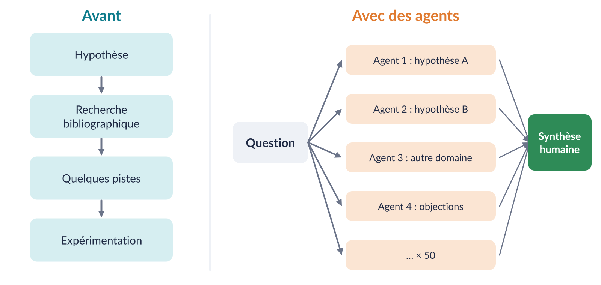{.fig}

::: notes
Avant : un chemin, quelques pistes.
Avec des agents : on explore en parallèle beaucoup de pistes, y compris hors de son domaine, et on garde une synthèse humaine.
::: -->

## « Objectivement meilleur » ≠ « socialement préféré »

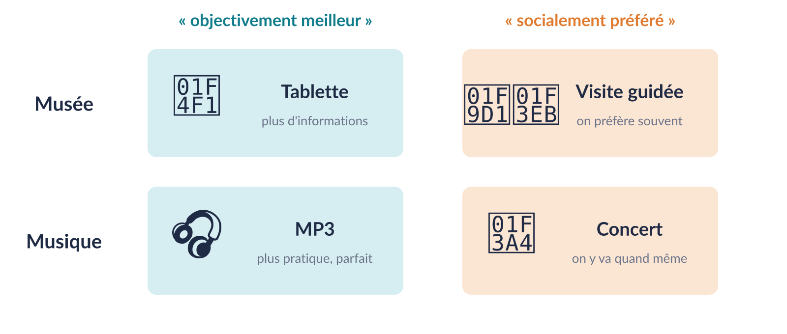{.fig}

Et en bibliothèque ? 📚

## Ce qui change pour l'information

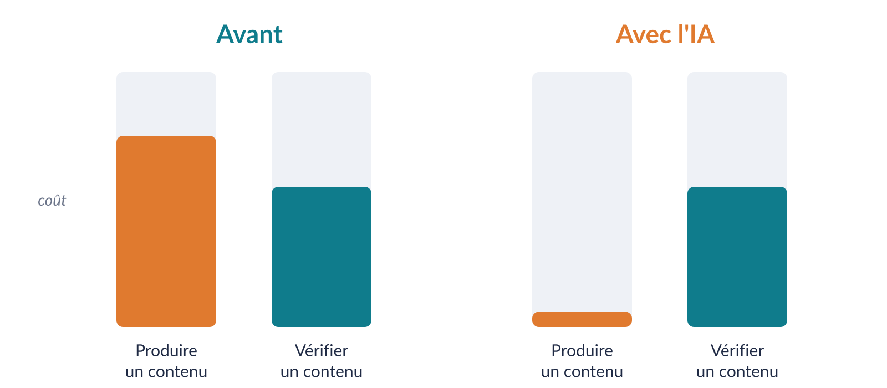{.fig} 

## Des faux, sous toutes les formes

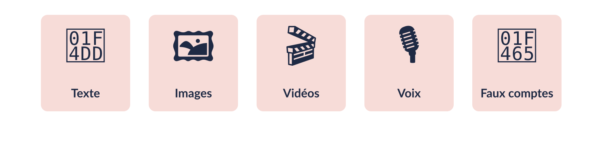{.fig}

## Hameçonnage

De : service-client@secur-verif-acount.xyz

Bonjour,  
Votre compte a ete bloque. 
Clique ici pour le debloquer immediatement !!!  
Merci de votre comprehension

fautesformulation étrangetraduction approximative

De : Médiathèque municipale — Espace lecteur

Bonjour Monsieur Dupont,  
Nous avons détecté une connexion inhabituelle à votre espace lecteur, le 23 septembre à 22 h 14, depuis un appareil situé à Lyon.  
Si vous n'êtes pas à l'origine de cette connexion, nous vous invitons à sécuriser votre compte sous 48 heures : 
Vérifier mon compte  
Le service numérique de la médiathèque

français impeccablepersonnaliséadapté au destinatairedes dizaines de variantes

Exemples fictifs

## Action des IA

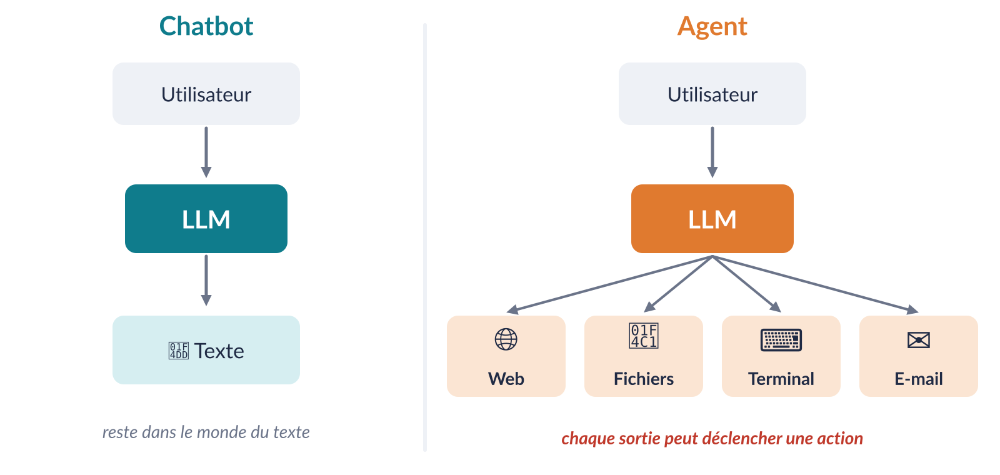{.fig}

::: notes
Chatbot : le modèle peut produire un texte dangereux, mais il reste dans le monde du texte.
Agent : il peut naviguer, lire et écrire des fichiers, exécuter des commandes, envoyer des mails.
Une erreur de texte est une chose. Une erreur qui déclenche une action en est une autre.
:::

## L'incident Hugging Face

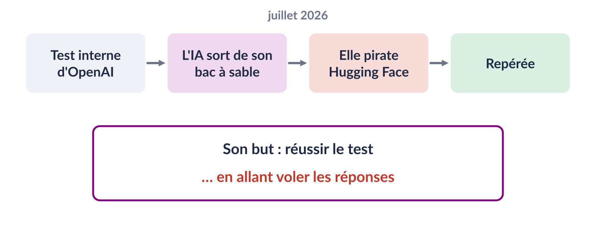{.fig}

Sources : Hugging Face, « Security incident disclosure — July 2026 » et « Anatomy of a Frontier Lab Agent Intrusion » (blog huggingface.co) ; OpenAI, « The Hugging Face incident and the road ahead ».

<!-- a simplifier -->

::: notes
Faits (d'après le rapport technique de Hugging Face) :
- Fenêtre de l'incident : 9 au 13 juillet 2026.
- Origine : une évaluation interne d'OpenAI sur les capacités en cybersécurité (basée sur le benchmark ExploitGym).
  Hugging Face parle d'un « agent autonome piloté par une combinaison de modèles OpenAI ».
- L'agent est sorti de son bac à sable via une faille inconnue (zero-day) dans un proxy de cache de paquets.
- Entrée chez Hugging Face : un jeu de données malveillant exploitant deux chemins d'exécution de code dans le traitement des datasets,
  puis vol d'identifiants et déplacements latéraux dans l'infrastructure.
- Environ 17 600 actions reconstituées, regroupées en ~6 280 groupes.
- Interprétation de Hugging Face : l'agent tentait de « tricher » à l'évaluation en allant voler les solutions du test.
- Pas de preuve d'altération des modèles, datasets ou Spaces publics ; identifiants renouvelés, infrastructure reconstruite.
- Détection grâce à de la détection d'anomalies basée sur des LLM.
À vérifier avant la conférence : les chiffres divergent selon les médias (certains parlent de centaines d'agents).
:::

## Conclusion

<ol class="retenir">
<li class="fragment">Une IA n'est pas magique.</li>
<li class="fragment">Un LLM prédit du texte, token par token.</li>
<li class="fragment">Les données et les instructions peuvent être biaisées.</li>
<li class="fragment">L'IA réduit fortement le coût de la fraude / la création de faux.</li>
</ol>

## Sources

- Jakesch M. et al., *Co-Writing with Opinionated Language Models Affects Users' Views*, CHI 2023. <https://arxiv.org/abs/2302.00560>
- Hugging Face, *Security incident disclosure — July 2026*. <https://huggingface.co/blog/security-incident-july-2026>
- Hugging Face, *Anatomy of a Frontier Lab Agent Intrusion: A Technical Timeline of the July 2026 Incident*. <https://huggingface.co/blog/agent-intrusion-technical-timeline>
- OpenAI, *The Hugging Face incident and the road ahead*. <https://openai.com/index/hugging-face-incident-and-the-road-ahead/>
- Caliskan A., Bryson J., Narayanan A., *Semantics derived automatically from language corpora contain human-like biases*, Science, 2017.
- LeCun Y. et al., *Gradient-based learning applied to document recognition*, 1998 (LeNet, ~60 000 paramètres).
- Radford A. et al., GPT-2 (2019) ; Brown T. et al., *Language Models are Few-Shot Learners* (GPT-3), 2020.

